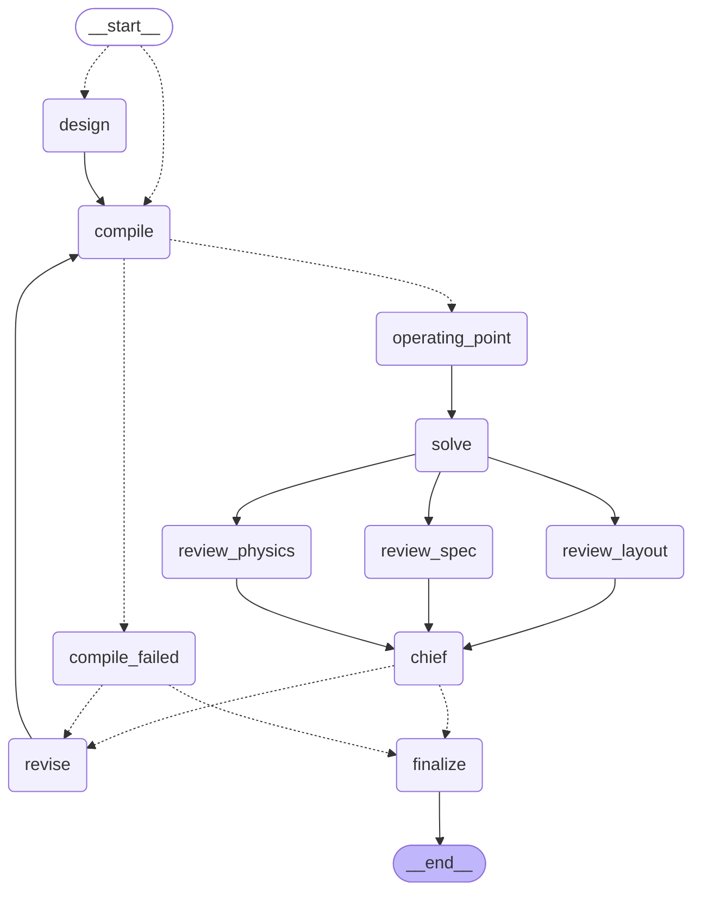

# pcb-ai

A recurrent PCB design loop, built as a **LangGraph** state machine and **model-agnostic**
across every LangChain chat provider. Agents write hardware description code; the
toolchain compiles, routes and renders it; solvers compute what the board does
thermally and electrically; three agents review it from different angles; a chief
engineer merges their findings into one work order; the designer revises. Repeat until
it holds up.

## The graph

Generated from the compiled graph, not drawn by hand:



Solid edges are unconditional, dotted are routed at runtime.

- **`__start__` is conditional** so a seed design skips generation and goes straight to
  compiling.
- **`solve` fans out to three reviews** with a common predecessor and a common
  successor, so LangGraph schedules them in one superstep and `chief` does not run
  until all three have landed. Measured: three 300ms nodes in that shape complete in
  **329ms**, not 900.
- **`revise → compile` is the recurrent edge.** The conditional edge out of `chief` is
  the only thing that ends the loop — pass, or the iteration budget.
- **`compile_failed`** exists because a design that does not compile has no geometry to
  analyse and nothing to look at. It writes a blocker verdict straight to the designer
  rather than sending an empty board through three reviews.
- **Concurrent state writes** go through a merging reducer: `reviews` is
  `(a, b) => ({...a, ...b})`, so three nodes writing in the same superstep is a merge
  rather than a last-write-wins race.
- **`MemorySaver` checkpointer**, keyed by the run directory as `thread_id`.

## Model-agnostic

Every agent talks to a `ChatLike` — the two methods this pipeline uses, `invoke` and
`withStructuredOutput`. `BaseChatModel` satisfies it structurally, so any LangChain
provider works and so does the offline stub.

```bash
--model google-genai:gemini-3.7-flash        # default
--model google-genai:gemini-3.1-pro-preview
--model anthropic:claude-opus-5
--model openai:gpt-5
--model bedrock:anthropic.claude-opus-5
--model ollama:llama3.2
--model laguna                               # local vLLM on the Spark, no key
--model stub                                 # offline fixture, no provider, no key
```

### Fully local — Laguna on the Spark

`--model laguna` targets an OpenAI-compatible endpoint served locally (vLLM running
`poolside/Laguna-S-2.1-NVFP4`; see `../setup/serve_laguna.sh`). No API key: the base URL
defaults to `http://localhost:8000/v1` and is overridden with `--base-url` or
`LAGUNA_BASE_URL`. `--model local:<name>` does the same for any other local server.

Laguna is a coding model with **no vision**, and that is declared rather than discovered:
each resolved model carries a `vision` capability, and when it is false the reviewing
agents are handed a **measured geometry digest** (`src/layout-digest.ts`) computed from
the same Circuit JSON the views are drawn from — placements, courtyard overlaps, edge
clearances, connector access, routing detours, silkscreen — and are told which views were
withheld. Dropping the images silently would leave a reviewer inventing findings about a
picture it never saw. `--check` probes each model against what it claims it can do, so a
text-only endpoint passes preflight instead of failing a vision test it was never going
to take.

21 providers resolve through `initChatModel`: openai, anthropic, azure_openai, cohere,
google, google-vertexai, google-genai, ollama, mistralai, groq, bedrock, deepseek, xai,
cerebras, fireworks, together, perplexity, and more.

**Per-role models.** Put a strong model on the design work and a cheap one on the
reading:

```bash
npm run design -- --spec board.md \
  --model-designer google-genai:gemini-3.1-pro-preview \
  --model-spec google-genai:gemini-3.5-flash-lite \
  --model-layout google-genai:gemini-3.5-flash-lite
```

Roles: `designer`, `modeler`, `physicist`, `layout`, `spec`, `chief`. Identical specs
resolve to one shared instance.

Two consequences of being provider-neutral:

- **Structured output is Zod**, not raw JSON Schema — `withStructuredOutput` is the one
  interface every provider implements, and each turns the Zod schema into whatever it
  needs (a tool definition, a response format, a grammar).
- **No provider-specific knobs in the pipeline.** Anthropic's `effort`, OpenAI's
  `reasoning_effort` and the rest go through the escape hatch:
  `--model-kwargs '{"thinking":{"type":"adaptive"}}'`.

`physicist`, `layout` and `spec` are handed rendered images, so **their model must be
multimodal**. Every Gemini model is. `designer`, `modeler` and `chief` are text-only.

### Gemini

The default is `google-genai:gemini-3.7-flash` — GA as of 13 Aug 2026, and the current
Gemini generation's strongest on software-engineering and agentic work, which is what
this loop is. `gemini-3.1-pro-preview` is the flagship (2M context) if you want it on
the designer role; `gemini-3.5-flash-lite` is the cheap option for the reading roles.
Avoid the 2.5 family — it shuts down 16 Oct 2026.

**The key can live in either `GEMINI_API_KEY` or `GOOGLE_API_KEY`.** Google's own docs
and SDKs use `GEMINI_API_KEY`; `@langchain/google-genai` only ever reads
`GOOGLE_API_KEY`. Following Google's quickstart would otherwise give you
"API key not valid" with your key sitting right there in the environment, so
`src/model.ts` resolves either name and passes `apiKey` explicitly. The same table
covers every other provider's key, and a missing one fails before any work starts
rather than four nodes into a run.

```bash
export GEMINI_API_KEY=...          # or GOOGLE_API_KEY
npm run design -- --check          # verify auth + structured output + vision
```

## The split that makes it work

Every step is either a measurement or a judgement, never both.

**Measurements** — deterministic code, no model involved. Netlist extraction,
steady-state thermal field, DC IR drop per rail, current density, IPC-2221 trace
capacity, geometric DRC against the board's own fabrication limits, electrical rule
checks. These are facts; the reviewing agents receive them as ground truth and the
chief engineer is not allowed to waive them — a hard failure forces `pass: false`
whatever the chief concluded. That override fires in the stub run below.

**Judgements** — what the agents are for. What the board is supposed to do, what
current each pin draws, whether a 40°C margin is comfortable or fragile, whether a
layout is sane, what to fix first.

The seam between them is the **operating point**: rail voltages, per-pin currents,
per-part dissipation. Circuit JSON has connectivity and geometry but not one ampere or
one watt, and no amount of geometry gets you there — it follows from what the parts are
and what the board is for. So a modelling agent establishes it, states its assumptions
in writing, and from there everything is arithmetic.

## The physics

Thermal and power integrity are the same equation on the same mesh:

```
∇·(K ∇u) + s − a·u = 0
```

- **Thermal** — `u` is temperature, `K` the sheet conductance of the copper/FR4 stack,
  `s` each part's dissipation over its own footprint, `a` convective loss off both
  faces. Copper coverage is rasterised from the actual routed geometry, so a part on an
  island of copper runs hotter than the same part with copper to conduct into.
- **Power integrity** — `u` is potential, `K` the sheet conductance of one net's
  copper, `s` current injected at the source pin and drawn at each load, `a` zero. The
  gradient of the solution gives current density.

On a regular grid the conductance between adjacent cells of a sheet is exactly the
sheet conductance — the `h/h` cancels — which is why one preconditioned-CG solver
covers both. `src/physics/field.ts` is the solver; `thermal.ts` and `power.ts` are thin
configurations of it.

Two details that took a bug each to get right, both documented in the code:

- Traces are rasterised as **capsules** (distance-to-segment), not chains of stamps.
  A 0.15mm trace on a coarser grid otherwise comes out as disconnected dots, the
  current has nowhere to go, and the solve diverges.
- Current density is differenced **only against neighbouring copper cells**. A centred
  difference across a copper/no-copper edge reads the full rail voltage as a gradient
  and reports ~10⁶ A/mm².

Loads the source cannot reach through copper are reported as islands rather than
solved — an unroutable rail is a finding, not a number.

### What is not modelled

Steady state only: no transients, no inrush, no switching. Natural convection with a
fixed coefficient: no forced air, no enclosure, no radiation. Two dimensions: the stack
is lumped into one plane, so via stitching and layer-to-layer spreading are
approximations. No AC analysis, no signal integrity, no EMC. It is a first-order model
and every report says so. Circuit simulation is a separate stage — see below.

## Circuit simulation (L7)

The solvers above answer *"does the copper survive this current"*. They cannot answer
*"is this current what the circuit intends"* — a regulator wired backwards routes and
fabricates exactly as well as one wired correctly. So the pipeline runs **ngspice** on a
deck built from the Circuit JSON and the operating point, and asserts claims against it.

```bash
./tools/vendor-ngspice.sh    # installs ngspice into .tools/ without root, and self-tests it
npx tsx src/cli.ts --seed examples/rover.tsx --model stub \
  --operating-point examples/rover-op.json --claims examples/rover-claims.json

npx tsx tools/spice-check.ts examples/rover.tsx examples/rover-op.json examples/rover-claims.json
```

A claim is `{kind, target, expected, tolerance, why}` where kind is `dc_rail`,
`node_voltage`, `current` (a window) or `current_max` (a ceiling). The gate is
two-directional: **every claim must pass, and every rail must be covered by a claim** —
otherwise an agent silences the stage by asserting nothing.

Three things the deck does that a generic converter does not, and they are the reason
this is hand-built rather than `circuit-json-to-spice` alone (that converter emits 24
lines for the rover: every passive, not one of the five ICs, and no source at all):

- **ICs become behavioural stubs** — a current sink of exactly what the operating point
  says that pin draws. A part with no model is *labelled*, never dropped. The rover
  reports **75% coverage: 21 modelled, 6 stubbed, 9 not represented**, and coverage is a
  number the regression suite can watch.
- **Floating nodes get a 1 GΩ path to ground** (`.options rshunt=1e9`). In DC a capacitor
  is an open circuit, so the crystal node — one cap to ground, crystal skipped, MCU pin
  unmodelled — makes the matrix singular and takes the whole simulation down with it.
- **Claims that cannot fail are flagged.** A `dc_rail` claim on a net the deck drives with
  an ideal source reads exactly its source voltage by arithmetic. Those are marked
  `[TAUTOLOGY]` and the report counts how many claims can actually fail.

Verified in both directions on the rover: good board **L7 PASS** (`NRST = 3.3000 V`,
`R2 = 1.3 mA`); with a planted 100 kΩ where R2's 1 kΩ belongs, **L7 FAIL**
(`R2 = 0.0000 A`) and the chief's `PASS` is overridden to `REVISE`.

## Agents

| Node | Model role | Sees | Decides |
|---|---|---|---|
| `design` / `revise` | `designer` | spec, work order | the HDL |
| `operating_point` | `modeler` | spec, netlist | rail voltages, currents, dissipation, assumptions |
| `review_physics` | `physicist` | solver output + thermal/IR heatmaps | whether the margins are real |
| `review_layout` | `layout` | schematic, PCB, assembly renders | placement, routing, assembly, readability |
| `review_spec` | `spec` | spec, netlist, renders | requirement-by-requirement compliance |
| `chief` | `chief` | everything above | one merged work order, and pass/fail |

The three reviews are independent and concurrent — they are meant to disagree. The
chief resolves the disagreement into an ordered work order and is the only node that
can accept the board.

## Placement rules (L3)

Every other gate checks that the board is correct. None of them checks that it is the
board that was *asked for* — a design with its connectors on the wrong sides has a valid
netlist, clean routing, sound physics and a manufacturable stackup.

The parts agent emits placement requirements twice: as prose for the designer to read,
and as `placement_rules` that a tool checks against the routed board.

```bash
npx tsx tools/placement-check.ts runs/<dir>/iter-0/circuit.json rules.json
npx tsx tools/placement-check.ts runs/<dir>/iter-0/circuit.json    # just report edges
```

| Rule | Checks |
|---|---|
| `at_edge(refs, edge, max_mm)` | the part sits against a named edge, or any edge |
| `opposite_edges(a, b)` | the two are on **opposing** sides, and both really at an edge |
| `same_edge(refs, edge)` | parts share one edge |
| `on_layer(refs or ["*"], layer)` | nothing is on the wrong side of the board |
| `adjacent(a, b, max_mm)` | decoupling against the pin it serves |
| `in_row(refs, axis, max_mm)` | indicator LEDs actually line up |

A rule naming a part that does not exist **fails** rather than being skipped, so a typo
cannot silently disable a gate. "No rules" is never reported as "passed": a parts plan
that emitted none is called out as unchecked.

Verified on the rover — asserting the two headers belong on opposite edges:

```
[opposite_edges] J1 is on the left edge and J2 is on the left edge
                 — both on the same side, not opposite ones.
[at_edge]        SW1 is 16.50 mm from its nearest edge (left), limit 3.00 mm
                 — it is sitting in the interior.
```

## Manufacturability (L8) and handoff files

The board is checked against a real fab's rules, and those rules are read out of a real
KiCad project rather than typed into a table:

```bash
npx tsx src/cli.ts --seed examples/rover.tsx --model stub \
  --operating-point examples/rover-op.json --fab-profile flight_controller.kicad_pro
npx tsx tools/dfm-check.ts runs/<dir>/iter-0/circuit.json flight_controller.kicad_pro
```

`src/dfm/profile.ts` reads `design_settings.rules` and the net classes straight from a
`.kicad_pro`, taking the stricter of the two wherever they overlap. Checked at L8: track
width, via diameter, drill, **annular ring**, hole-to-hole, copper-to-edge, silkscreen
legibility. Severities come from the project's own `rule_severities` — errors gate,
warnings report.

What it found on its first run, against a 4-layer flight controller profile: **every
board in this repo fails the same way** — 75 vias at 0.300 mm pad on a 0.200 mm drill,
a 0.050 mm annular ring against a 0.100 mm minimum. The default via stack is not
manufacturable, and nothing had checked before.

Alongside the Gerbers, every run can emit files other tools open:

- **A KiCad 9 project** — `.kicad_pro` + `.kicad_sch` + `.kicad_pcb`, 36 footprints and
  960 track segments for the rover. `kicad-cli` will not install on this aarch64 box
  without root, so the second-opinion DRC cannot run here — emitting the project anyway
  means a human, or any machine that has KiCad, can still run it.
- **A GLB** of the board with its parts placed, for CAD and for the viewer.

## Viewing a run

```bash
npx tsx tools/make-viewer.ts runs/<dir>
```

One self-contained HTML file: schematic, PCB and assembly renders, an orbitable 3D
board, the thermal and IR-drop fields, every gate report, and a status strip up top
showing which gates passed. three.js is bundled inline and the GLB is base64 — no
network, no dev server, ~4.3 MB.

## Benchmarking

```bash
npx tsx tools/bench.ts --boards rover,rover-packed,blinker --lanes path-a \
  --fab-profile flight_controller.kicad_pro
```

Writes `runs/bench/scorecard.md` and `.json`. It also scores **netlist similarity**
against a reference board — Jaccard and F1 over net connection-sets, compared
structurally by pin endpoints so autogenerated net names do not matter. That metric came
from Microsoft SchGen, and it earned its place immediately: `rover-packed` vs `rover`
scores **1.000** while cutting area 4960 → 3312 mm² and vias 75 → 60. The packer moved
everything and changed no connection, which is exactly the claim a placement tool has to
prove.

## Setup

```bash
npm install --legacy-peer-deps    # sharp cannot build on aarch64 without libvips-dev
export GEMINI_API_KEY=...           # or GOOGLE_API_KEY / ANTHROPIC_API_KEY / OPENAI_API_KEY
```

## Use

```bash
# design from a specification
npm run design -- --spec examples/spec-usb-hub-power.md --iterations 3

# analyse and improve an existing design
npm run design -- --seed examples/blinker.tsx --spec examples/spec-usb-hub-power.md

# exercise the whole graph offline — no provider, no key
npm run design -- --seed examples/blinker.tsx --model stub \
  --operating-point examples/blinker-operating-point.json
```

| Flag | Default | |
|---|---|---|
| `--iterations <n>` | `3` | analyse/review/revise rounds |
| `--model <id>` | `google-genai:gemini-3.7-flash` | `provider:model`, or `stub` |
| `--model-<role> <id>` | — | override one role |
| `--model-kwargs <json>` | — | provider-specific extras |
| `--out <dir>` | `runs/<timestamp>` | |
| `--operating-point <f>` | — | analyse against this instead of asking the modeller |
| `--check` | — | verify each configured model answers, then exit |

`--operating-point` is also how you pin the analysis to numbers you trust rather than
modelled ones.

## Testing the graph without a provider

`--model stub` swaps in `src/models/stub.ts`, a fixture that returns canned
schema-shaped responses keyed off the structured-call name. It cannot tell you whether
a real model designs good boards. It does tell you every node runs, state flows, the
fan-out and join fire, the loop-back edge fires, the hard-failure override fires, and
every artifact lands. A stub run on the 555 blinker:

```
── iteration 0 ──
  compile   8 parts, 7 nets, 0 errors, 3 warnings
  model     1 rail(s), 3 load(s), 0.061W total
  physics   peak 37.9°C, 1 rail(s) solved, 0 DRC errors, 1 hard failure(s)
  physicist 0 finding(s) — stub model: no review performed.
  layout    0 finding(s) — stub model: no review performed.
  spec      0 finding(s) — stub model: no review performed.
  verdict   REVISE — 0 blocker, 0 major, 0 minor
            stub model: accepted without review. (Overridden: 1 hard failure(s)
            from the rule checker or solvers remain.)
  revising…

── iteration 1 ──
  compile   3 parts, 3 nets, 0 errors, 0 warnings
  physics   peak 31.2°C, 1 rail(s) solved, 0 DRC errors, 0 hard failure(s)
  verdict   PASS
```

Iteration 0 is the override working: the stub said "accepted", the ERC had found the
555 with no VCC decoupling capacitor anywhere, and the graph went round again anyway.

Adding a structured call without adding a stub case makes the stub run fail loudly
rather than silently skip.

## Output

```
runs/<timestamp>/
  spec.md
  iter-0/
    circuit.tsx            the HDL for this revision
    circuit.json           compiled Circuit JSON
    report.txt             netlist, components, compiler errors and warnings
    schematic|pcb|assembly .svg/.png
    operating-point.json   the modelled rails, loads and dissipation
    physics.txt            thermal, IR drop, trace current, DRC, ERC
    physics/
      thermal.svg/.png     labelled temperature field
      ir-drop-<net>.svg/.png
    reviews.json           what each reviewer independently found
    verdict.json           the merged work order that drove the next revision
  iter-1/ …
  final.tsx
  summary.json             per iteration: peak temperature, max IR drop, DRC errors,
                           hard failures, findings per reviewer, pass
  fabrication/             *.gbr, plated.drl, unplated.drl, bom.csv
```

## Layout

```
src/
  graph.ts             the LangGraph state machine — nodes, edges, reducers
  model.ts             provider-agnostic model layer (ChatLike, roster, content blocks)
  schemas.ts           Zod schemas for every structured call
  models/stub.ts       offline fixture model
  agents/              one file per agent, each takes a ChatLike
  physics/             solver, rasteriser, thermal, power, rules, heatmap render
  build.ts             HDL → Circuit JSON → netlist + rendered views
  fab.ts               Gerber, Excellon drill, BOM
  hdl-guide.ts         the HDL reference handed to the designer
```

`build.ts` is the only tscircuit-specific file. Everything under `physics/` and
`agents/` works off Circuit JSON and would survive a backend swap.

## On JITX

JITX was evaluated as the HDL backend and is blocked on authentication, verified rather
than assumed: `pip install jitx` works (4.2.2 on PyPI, Python ≥3.12), `jitx runtime
install` pulls the 1.2 GB native runtime with no account, `jitx project layout init`
and `jitx runtime start` both work — and then `jitx build-all` fails with **`You are
not authenticated. Please sign in through the JITX Sidebar in VSCode.`**

Signing in needs your account. If you do, the adapter is real work rather than a config
change: the physics engine consumes tscircuit **Circuit JSON** and JITX exports KiCad
and Gerber instead. JITX also publishes official agent skills (`JITx-Inc/jitx-skills`)
that would replace `src/hdl-guide.ts` and most of `src/agents/designer.ts`.

The evaluation left a **1.2 GB runtime in `~/.jitx`** — `rm -rf ~/.jitx` if you are not
going to use it.

## Limits

- **The graph is tested; the agents are not.** Every node, edge, reducer, the fan-out,
  the join, the loop-back and the override have been exercised end to end with
  `--model stub`, plus the compile-failure branch. No call against a real provider has
  completed — there was no Gemini key on this machine. Prompts and real-model
  structured output are unexercised. What *was* confirmed against Google's live
  endpoint, using a deliberately invalid key: the `GEMINI_API_KEY` bridge resolves, the
  request reaches `generativelanguage.googleapis.com` at `gemini-3.7-flash`, and the
  multimodal payload builds. It came back `API_KEY_INVALID`, which is the correct
  failure for a fake key and the wrong one to read as "it works".
- The thermal and IR models are first-order (see *What is not modelled*). They catch
  gross problems — a part over its rating, a rail that necks down, heat with nowhere to
  go. They are not a substitute for FEA on anything that matters.
- Structured output quality varies by provider. Google, Anthropic and OpenAI implement
  `withStructuredOutput` through native tool calling; smaller local models via Ollama
  are far less reliable at it, and the pipeline will surface that as parse failures.
  Every schema here stays inside the subset Gemini's function-calling accepts — plain
  objects, arrays, strings, numbers, booleans and enums, no unions and no
  `additionalProperties` — so nothing needs a provider-specific variant.
- Gerbers are produced but not checked against a specific fab's rule set.
- Nothing here replaces a human review before you spend money on fabrication.
